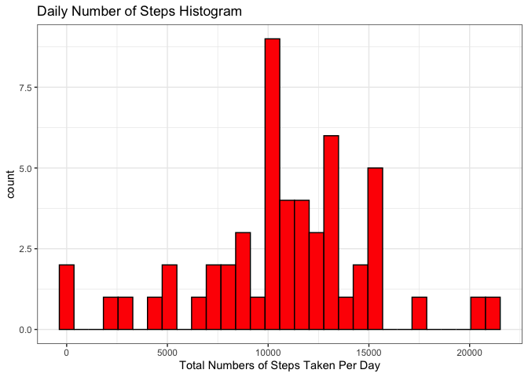
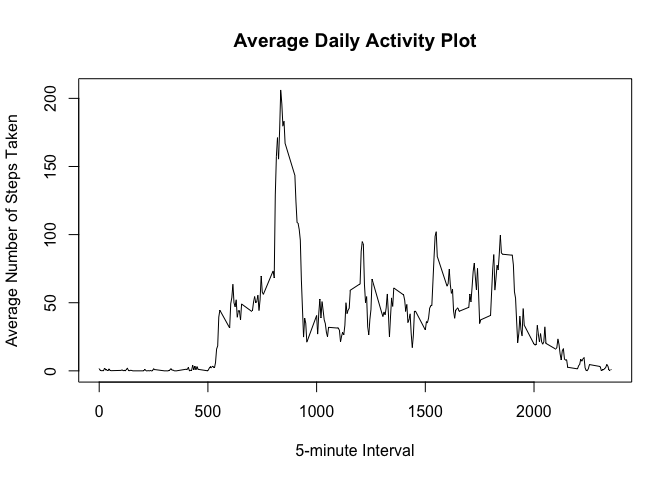
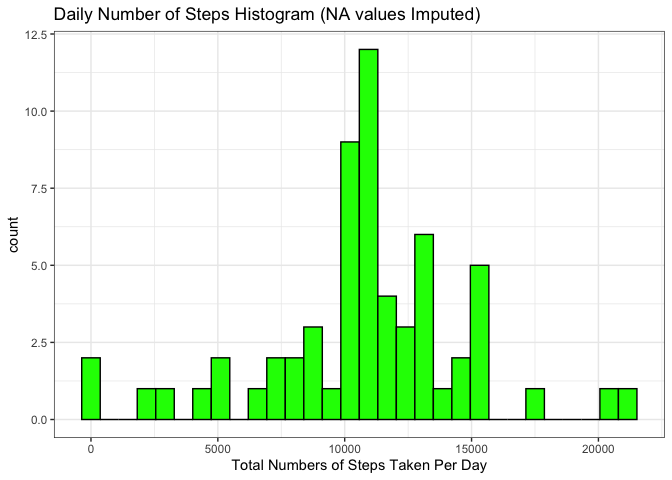
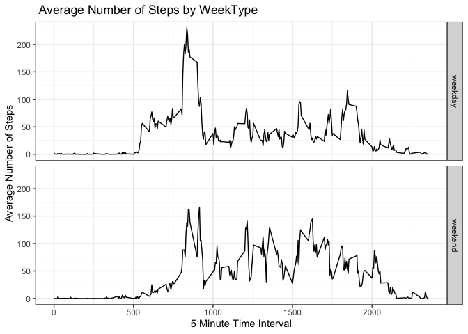

## Introduction

This is an R Markdown document that addresses the questions in JHU Coursera Reproducible Research Course Project 1. The dataset used for this project is based on data from a personal activity monitoring device which collected data at 5 minute intervals through out the day. This data set consists of two months of data from an anonymous individual collected during the months of October and November, 2012 and includes the number of steps taken in 5 minute intervals each day. The dataset was stored in a comma-separated-value file. 

## Question 1 : Loading and preprocessing the data.
The dataset was loaded using the read.csv function after setting the working directory to the location where the activity data csv file was saved. The R code below loads the data and uses the str function to check the contents of the file. The file consist of 17568 observations and 3 variables. To have the data in a format suitable for further analysis, the date column data was converted from character type to date type and the resulting data frame converted to a tibble data frame.


```r
setwd("/Users/toyerinde/Desktop/DataScience")
activity_data<-read.csv("./Reproducible Research/activity.csv")
str(activity_data)
```

```
## 'data.frame':	17568 obs. of  3 variables:
##  $ steps   : int  NA NA NA NA NA NA NA NA NA NA ...
##  $ date    : chr  "2012-10-01" "2012-10-01" "2012-10-01" "2012-10-01" ...
##  $ interval: int  0 5 10 15 20 25 30 35 40 45 ...
```

```r
activity_data$date<-as.Date(as.character(activity_data$date),"%Y-%m-%d")
library(dplyr)
```

```
## 
## Attaching package: 'dplyr'
```

```
## The following objects are masked from 'package:stats':
## 
##     filter, lag
```

```
## The following objects are masked from 'package:base':
## 
##     intersect, setdiff, setequal, union
```

```r
activity_datatb<-tibble::as_tibble(activity_data)
```

## Question 2 : What is the mean total number of steps taken per day?
To address this question, you are required to plot a histogram of the total number of steps taken/day by the anonymous individual and then calculate and report the mean and median of the total number of steps taken/day. For this part of the assignment, the missing values in the dataset was ignored. The R code below details the steps taken to answer this question:

### Calculating the total number of steps taken per day

```r
activity_datatotal<-activity_datatb %>%
  select(steps,date) %>%
  group_by(date) %>%
  summarize(Steps_total = sum(steps))
```
### Plotting the histogram of the total number of steps taken each day

```r
library(ggplot2)
g<-ggplot(activity_datatotal,aes(x=Steps_total))
g+geom_histogram(color='black',fill="red")+labs(x="Total Numbers of Steps Taken Per Day", title="Daily Number of Steps Histogram")+theme_bw()
```

```
## `stat_bin()` using `bins = 30`. Pick better value with `binwidth`.
```

```
## Warning: Removed 8 rows containing non-finite values (stat_bin).
```

<!-- -->


### Calculating the mean and median of the total number of steps taken/day 

```r
mean_ts<-mean(activity_datatotal$Steps_total,na.rm=TRUE)
median_ts<-median(activity_datatotal$Steps_total,na.rm=TRUE)
```
The mean total number of steps taken per day is **1.0766189\times 10^{4}.**

The median total number of steps taken per day is **10765.**


## Question 3: What is the average daily activity pattern?
To address this question, a time series plot of the 5 minute intervals vs. average number of steps taken averaged across all days was generated and the 5 minute interval with the maximum number of steps determined. The R code below shows the various steps taken to address this question.

### Generating time series plot data
The code below calculates the average number of steps taken for each 5 minute interval averaged across all days in the dataset.


```r
activity_datapattern<-tapply(activity_datatb$steps,activity_datatb$interval,mean,na.rm=TRUE,simplify=T)

lineplotdf<-data.frame(Time_interval= as.numeric(names(activity_datapattern)),Avg_Steps= activity_datapattern)
```
### Plotting time series plot

```r
with(lineplotdf,plot(Time_interval,Avg_Steps, type ="l",xlab="5-minute Interval", ylab="Average Number of Steps Taken", main = "Average Daily Activity Plot"))
```

<!-- -->


### Determining the 5-minute interval with the maximum number of steps

```r
lineplotdfsort<-arrange(lineplotdf,desc(Avg_Steps))
Time_IntervalMax<-lineplotdfsort[1,1]
```
The 5 minute interval with the maximum number of steps is **835.**

## Question 4 : Imputing Missing Values.
To address this question,a strategy was devised to fill in all the missing values in the dataset and then regenerate the total number of steps histogram and recalculate the mean and median of the total number of steps using the newly updated dataset i.e original dataset with the missing values filled. The strategy that was used for imputing the missing values was the mean of the missing value 5 minute interval. The R code below shows the steps taken to address this.

### Calculating the number of missing values in original dataset

```r
Missing_datanum<-sum(is.na(activity_datatb))
```
The total number of missing values in the dataset is **2304.**

### Imputing the missing values in the dataset and creating the updated dataset

```r
activity_datanafix<-activity_datatb %>%
  group_by(date) %>%
  mutate(steps = ifelse(is.na(steps),tapply(activity_datatb$steps,activity_datatb$interval,mean,na.rm=TRUE,simplify=T),steps))
```
### Recalculating the total number of steps/day

```r
activity_datanafixtotal<-activity_datanafix %>%
  select(steps,date) %>%
  group_by(date) %>%
  summarize(Stepsnafix_total = sum(steps))
```
### Regenerating the total number of steps histogram

```r
g<-ggplot(activity_datanafixtotal,aes(x=Stepsnafix_total))
g+geom_histogram(color="black",fill="green")+labs(x="Total Numbers of Steps Taken Per Day", title="Daily Number of Steps Histogram (NA values Imputed)")+theme_bw()
```

```
## `stat_bin()` using `bins = 30`. Pick better value with `binwidth`.
```

<!-- -->


### Recalculating the mean and median of total number of steps taken.

```r
mean_nafixts<-mean(activity_datanafixtotal$Stepsnafix_total,na.rm=TRUE)
median_nafixts<-median(activity_datanafixtotal$Stepsnafix_total,na.rm=TRUE)
```
The mean total number of steps taken /day after imputing missing values is **1.0766189\times 10^{4}.**

The median total number of steps taken /day after imputing missing values is **1.0766189\times 10^{4}.**

The newly calculated mean and median values do not differ much from the values calculated when the missing values were ignored. This shows negligible impact of imputing missing values on the estimates of total number of steps calculation. This may be due to the fact that the missing values only represent 13% of the values in the dataset. On the other hand the histograms do show a noticeable difference in the total number of steps frequency between 10000 and 12500 steps.

## Question 5: Are there differences in activity patterns between weekdays and weekends?
To address this question, a new factor variable was added to the new updated dataset to classify each date into either a weekday or weekend and a panel time series plot of 5 minute intervals vs. average number of steps taken averaged across all days was generated for each week day type. The R code below details the steps taken to generate this comparison plot.

### Creating the factor variable and adding to updated dataset

```r
library(lubridate)
```

```
## 
## Attaching package: 'lubridate'
```

```
## The following objects are masked from 'package:base':
## 
##     date, intersect, setdiff, union
```

```r
activity_datanafix$wktype<-as.factor(ifelse(wday(activity_datanafix$date)>1 & wday(activity_datanafix$date)<=6,"weekday","weekend"))
```

### Generating time series plot data

```r
activity_datanafixwkday<-filter(activity_datanafix,wktype=="weekday")
activity_datanafixwkend<-filter(activity_datanafix,wktype=="weekend")
lineplotwkdaydata<-tapply(activity_datanafixwkday$steps,activity_datanafixwkday$interval,mean,na.rm=TRUE,simplify=T)
lineplotwkenddata<-tapply(activity_datanafixwkend$steps,activity_datanafixwkend$interval,mean,na.rm=TRUE,simplify=T)
lineplotwkdaydf<-data.frame(Time_interval= as.numeric(names(lineplotwkdaydata)),Avg_Steps= lineplotwkdaydata,wktype=as.factor("weekday"))
lineplotwkenddf<-data.frame(Time_interval= as.numeric(names(lineplotwkenddata)),Avg_Steps= lineplotwkenddata,wktype=as.factor("weekend"))
lineplotwktypedf<-rbind(lineplotwkdaydf,lineplotwkenddf)
```
### Generating time series panel plot

```r
g<-ggplot(lineplotwktypedf,aes(x=Time_interval,y=Avg_Steps))
g+geom_line()+facet_grid(wktype~.,margins=FALSE)+labs(x="5 Minute Time Interval", y= "Average Number of Steps", title= " Average Number of Steps by WeekType")+theme_bw()
```

<!-- -->


**The panel plot showed that although the peak in the average number of steps taken occurred during the weekday, there seemed to be more number of steps taken over the weekend.**
